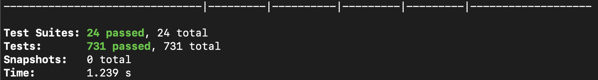
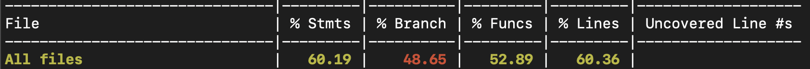

# 🎸 JamStoreApp

## Descripción del Proyecto

**JamStoreApp** es una aplicación móvil desarrollada en React Native que implementa una tienda virtual de instrumentos musicales. La aplicación está construida siguiendo los principios de **Arquitectura Hexagonal (Clean Architecture)** y utiliza **Redux** para el manejo del estado global.

### 🏗️ Arquitectura

La aplicación está estructurada en capas siguiendo los principios de Clean Architecture:

- **Domain Layer**: Entidades de negocio (Product, CartItem) y servicios del dominio
- **Application Layer**: Casos de uso y lógica de aplicación
- **Infrastructure Layer**: Implementaciones concretas de repositorios y servicios externos
- **UI Layer**: Componentes React Native y pantallas de la aplicación
- **State Management**: Redux con Redux Toolkit para manejo del estado global

### 🎯 Funcionalidades Principales

- **Catálogo de Productos**: Visualización de instrumentos musicales con precios en COP
- **Carrito de Compras**: Gestión de productos seleccionados
- **Procesamiento de Pagos**: Validación de tarjetas de crédito y procesamiento de transacciones
- **Navegación Intuitiva**: Sistema de navegación entre pantallas (Splash, Home, Cart)
- **Validaciones**: Validación de formularios, tarjetas de crédito y datos de entrada

## 🚀 Instrucciones de Ejecución

### Prerrequisitos

- Node.js >= 18
- React Native CLI
- Android Studio (para Android) o Xcode (para iOS)
- CocoaPods (para iOS)

### Instalación

1. **Clonar el repositorio**
   ```bash
   git clone <repository-url>
   cd JamStoreApp
   ```

2. **Instalar dependencias**
   ```bash
   npm install
   ```

3. **Instalar dependencias de iOS (solo para desarrollo en iOS)**
   ```bash
   bundle install
   bundle exec pod install
   ```

### Ejecución del Proyecto

1. **Iniciar Metro Bundler**
   ```bash
   npm start
   ```

2. **Ejecutar en Android**
   ```bash
   npm run android
   ```

3. **Ejecutar en iOS**
   ```bash
   npm run ios
   ```

### Comandos Disponibles

- `npm start` - Inicia Metro Bundler
- `npm run android` - Ejecuta la app en Android
- `npm run ios` - Ejecuta la app en iOS
- `npm run lint` - Ejecuta ESLint para verificar el código
- `npm test` - Ejecuta todos los tests
- `npm run test:cov` - Ejecuta tests con reporte de cobertura

## 🧪 Testing

### Ejecutar Tests

```bash
# Ejecutar todos los tests
npm test

# Ejecutar tests con coverage
npm run test:cov
```

## 📊 Cobertura de Código

### Estado Actual


### Resumen del Coverage


## 🛠️ Tecnologías Utilizadas

- **React Native 0.81.0** - Framework de desarrollo móvil
- **TypeScript 5.8.3** - Tipado estático para JavaScript
- **Redux Toolkit 2.8.2** - Manejo del estado global
- **Jest 29.6.3** - Framework de testing
- **ESLint** - Linting del código
- **Prettier** - Formateo del código

---

**Desarrollado con ❤️ usando React Native y Clean Architecture**
